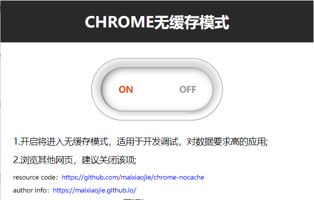
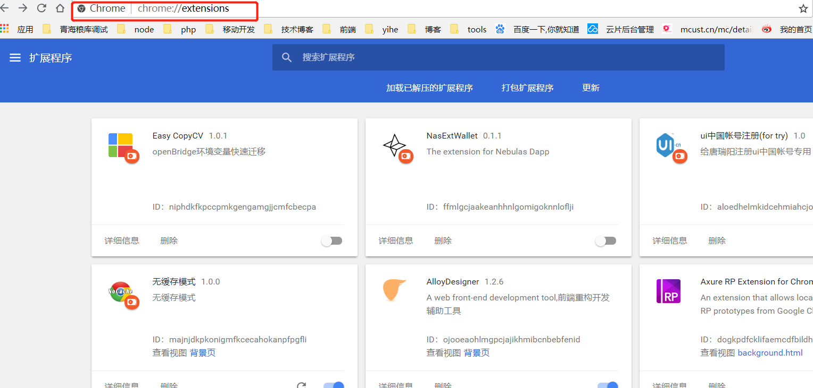
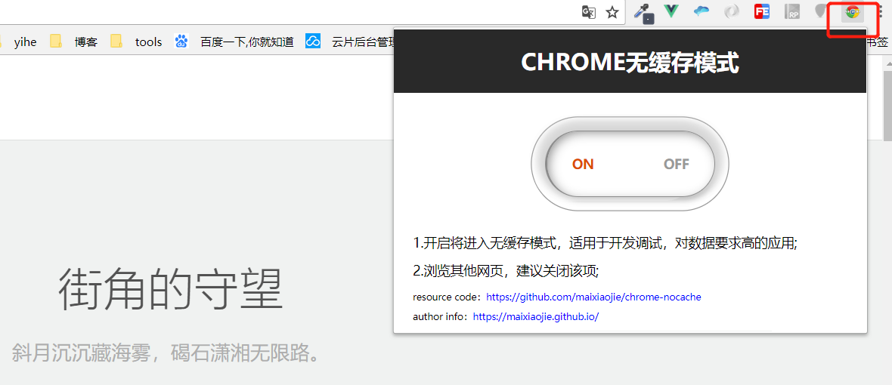

## chrome-nocache
> 一款chrome浏览器插件，能够让所有请求无缓存。

> A chrome browser plugin that makes all requests uncached.

### 自定义开关 (Custom switch)

能够方便的进行控制。

Easy to control.

### 适用人群 (For people)

此插件适合所有浏览器相关的开发者，开发过程中缓存问题导致的一些问题，可以尝试使用此插件。

This plugin is suitable for all browser-related developers, some problems caused by caching problems during development, you can try this plugin.

### 使用方法 (How to use)

1. download `/dist/webRequest.crx`.

2. enter `chrome://extensions/`.

3. drag the download file into the page body.

4. when the chrome load the pligins, you will see this:

5. ok, then you will controll them.

### 问题 (issue)

**email: tracywyj@gmail.com**

你可以直接提issue或者发邮件给我。

you can pull new issue or email to me.

### other

if this plugins can help you, please give me a star, thank you ~
